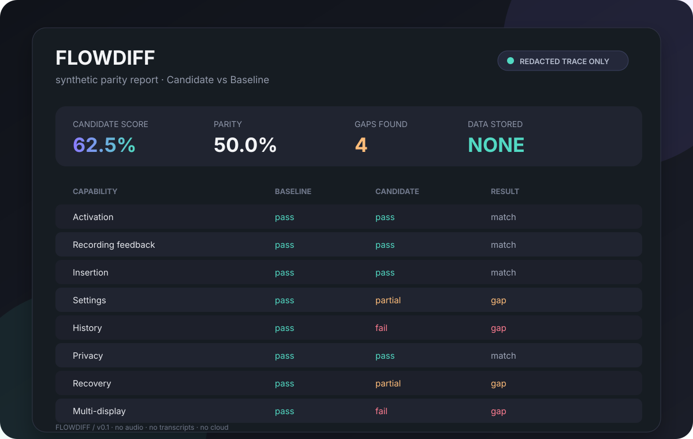

# FlowDiff

## Dictation UX, made diffable.

FlowDiff turns a small, redacted capability trace into a parity matrix. It is
for the moment after you test two dictation apps and realize the comparison
should be repeatable, reviewable, and much less vibes-based.

FlowDiff is a local-first Codex plugin and dependency-free Python tool. It
does not record audio, inspect a screen, read dictated text, open a URL, or
send data anywhere. Feed it capability outcomes; get a clean report.

## Why it exists

Dictation UX comparisons often repeat the same checks: activation, recording
feedback, insertion, settings, history, privacy, recovery, and multi-display
behavior. FlowDiff gives those checks a stable vocabulary and makes the
candidate gaps obvious in one pass.

It is deliberately not a recorder or a product analytics SDK. The input is a
human- or test-authored trace of outcomes, not a dump of computer activity.

## Quick start

Run the synthetic demo:

    python3 server.py --demo --format markdown

Run the test suite:

    python3 -m unittest discover -s tests -v

The demo contains only the labels Baseline and Candidate plus synthetic
evidence codes. It creates no files and makes no network requests.

## Use it in Codex

Install the plugin from this repository, start a new Codex thread, and ask:

    Compare these sanitized dictation UX traces.

The plugin exposes two read-only MCP tools:

- validate_dictation_trace checks a single trace against the FlowDiff schema.
- compare_dictation_traces returns a parity matrix, score, timing deltas, and
  bounded gap descriptions.

## Trace contract

Every trace contains exactly eight capability events. Unsupported or untested
capabilities should be marked skipped or unknown; they cannot claim a timing
result.

    {
      "schema_version": "1",
      "app": "Candidate",
      "run_id": "demo-candidate",
      "events": [
        {
          "capability": "activation",
          "status": "pass",
          "duration_ms": 150,
          "evidence_codes": ["shortcut_fired", "bar_opened"]
        }
      ]
    }

The full capability list is activation, recording_feedback, insertion,
settings, history, privacy, recovery, and multi_display. Evidence codes are
bounded per capability so arbitrary notes cannot leak into a report.

## Privacy contract

FlowDiff is intentionally strict:

- no audio, transcripts, message bodies, clipboard contents, screenshots, URLs,
  paths, contact details, credentials, or persistent personal identifiers;
- no network client, database, telemetry, or cache;
- no arbitrary fields in traces;
- no storage of inputs after a tool call;
- public examples use synthetic labels and evidence codes only.

The server fails closed when a trace contains an unsupported field, unsafe
label, unknown capability, or incomplete matrix. A valid report is evidence
from the supplied trace, not proof that a dictation app is production-ready.

## Project shape

server.py contains the dependency-free MCP stdio server, trace validator,
comparison engine, Markdown renderer, and synthetic demo.

tests/test_server.py covers normalization, scoring, failure modes, MCP
dispatch, and the privacy boundary.

docs/flowdiff-demo.svg is a synthetic report card for the README. It contains
no captured application output.

## Architecture

    sanitized trace
          |
          v
    strict validator  --->  fail closed on private or unknown fields
          |
          v
    capability normalizer
          |
          v
    comparator  -------->  parity matrix + bounded timing deltas
          |
          v
    JSON or Markdown report

## Shareable hook

Proof, not vibes, for voice UX.

Launch-post draft:

    I built FlowDiff: a local-first parity matrix for dictation UX.
    Feed it redacted capability events, get actionable regression gaps.
    No transcripts. No screenshots. No cloud.

## License

MIT. See LICENSE.
